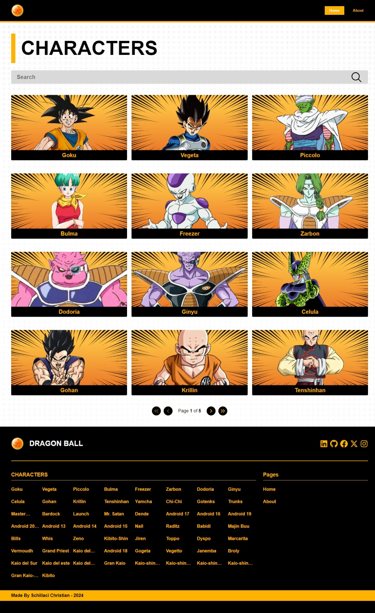
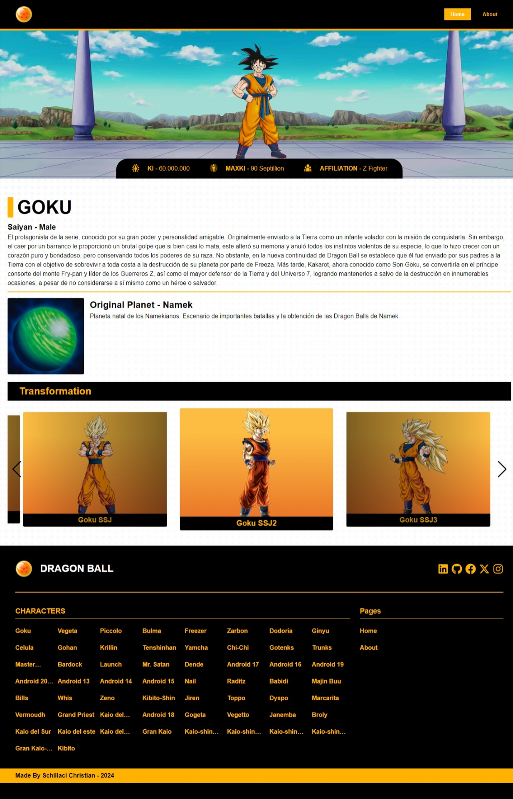
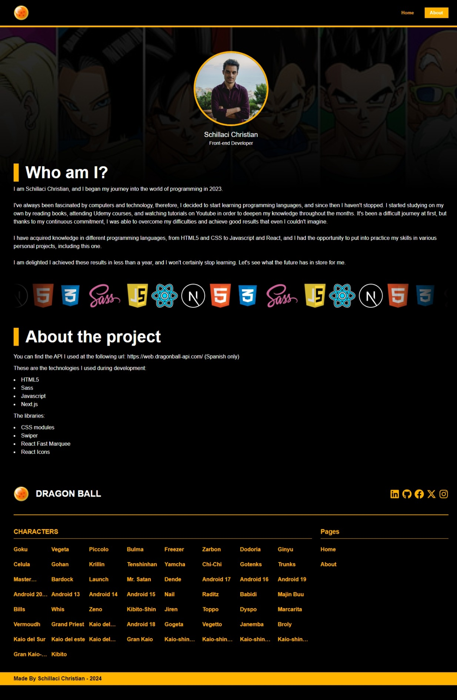
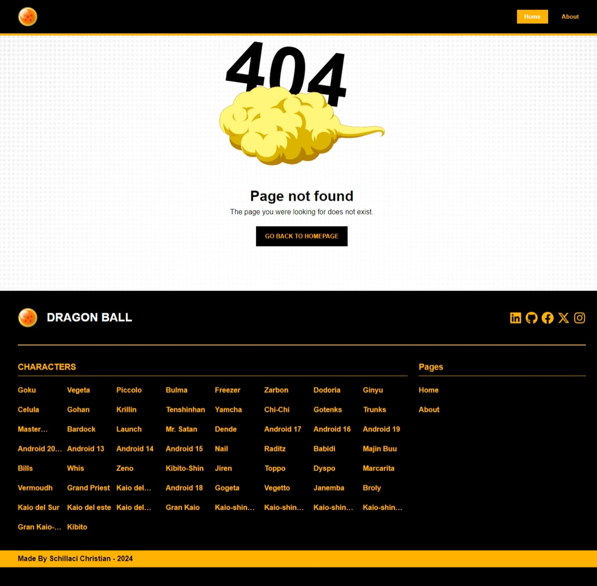

This is a [Next.js](https://nextjs.org/) project bootstrapped with [`create-next-app`](https://github.com/vercel/next.js/tree/canary/packages/create-next-app).

## Getting Started

First, clone the repository

Then, run the development server:

```bash
npm run dev
# or
yarn dev
# or
pnpm dev
# or
bun dev
```

Open [http://localhost:3000](http://localhost:3000) with your browser to see the result.

## Project Info

This project was made during the code-week of Edgemony Bootcamp.
It was made thanks to an API you can find at the following url: https://web.dragonball-api.com/.

<body>
On the home page, the user is able to:
<li>switch between different pages (Home and About);</li>
<li>
search a character by entering the name;
</li>
<li>
click the page buttons in order to see a different list of character;
</li>
<li>
click either on the character's image, which leads the user to the detail page of that character, or on the names located at the bottom of the page.
</li>
<br>
<div align='center' >

</div>
<br>

On the detail page, the user can see the character's info such as stats, description, place of birth and transformations(they may not have transformations).

<div align='center'>

</div>
<br>
On the about page, the user can see an developer's introduction and its technologies used during development.
<br>
<br>

<div align='center' >

</div>
<br>
And last but not least, the page 404 is shown if the user were to visit a page that does not exist.
<br>
<br>
<div align='center'  >

</div>

<h2>Technologies:</h2>
<ul>
<li>HTML5</li>
<li>Sass</li>
<li>Javascript</li>
<li>Next.js</li>
</ul>
<h2>Libraries:</h2>
<ul>
<li>CSS Modules</li>
<li>Swiper</li>
<li>React-Fast-Marquee</li>
<li>React Icons</li>
</ul>
</body>
